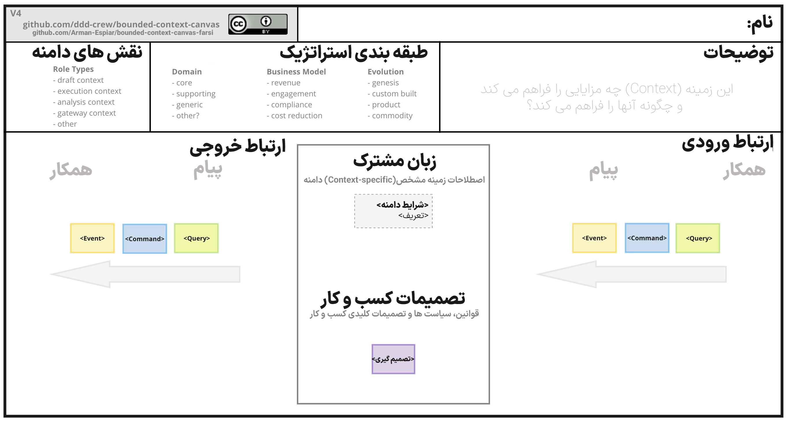
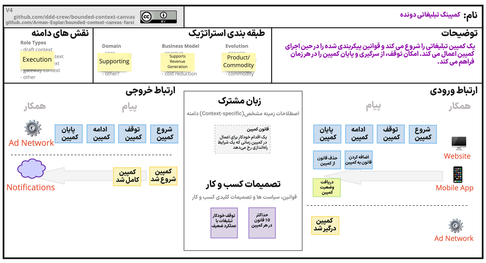

# The Bounded Context Canvas

The Bounded Context Canvas is a collaborative tool for designing and documenting the design of a single bounded context.

A [bounded context](https://martinfowler.com/bliki/BoundedContext.html) is a sub-system in a software architecture aligned to a part of your domain.

The canvas guides you through the process of designing a bounded context by requiring you to consider and make choices about the key elements of its design, from naming to responsibilities, to its public interface and dependencies.

Download the [blank canvas template](resources/bounded-context-canvas-4v-blank.jpeg).

بوم Bounded Context یک ابزار مشارکتی برای طراحی و مستندسازی طراحی یک Bounded Context است.

یک [bounded context](https://martinfowler.com/bliki/BoundedContext.html) یک زیر سیستم در معماری نرم افزار است که با بخشی از دامنه شما همراستا است.

بوم شما را از طریق فرآیند طراحی یک Bounded Context راهنمایی می‌کند و از شما می‌خواهد عناصر کلیدی طراحی آن، از نام‌گذاری گرفته تا مسئولیت‌ها، تا Interface عمومی و وابستگی‌های آن را در نظر بگیرید و انتخاب کنید.

Download the [blank canvas Farsi template](resources/bounded-context-canvas-4v-blank-farsi.png).

## How to Use - چگونگی استفاده

>To quickly get started with the Bounded Context Canvas, complete the canvas in the order the sections are presented in [Section Definitions](#section-definitions)

Start with the name and description of the canvas to clarify its reason for existing and key responsibilities in a sentence or two. Then you can fill in the other sections of the canvas in any order. You could design outside-in starting with inbound communication or inside out starting with the business rules and domain language.

با نام و توضیحات بوم شروع کنید تا دلیل آن برای مسئولیت های موجود و کلیدی در یکی دو جمله روشن شود. سپس می توانید قسمت های دیگر بوم را به ترتیب پر کنید. شما می توانید از خارج به داخل طراحی کنید که با ارتباطات ورودی شروع شود یا از داخل به بیرون با قوانین کسب و کار و زبان دامنه شروع کنید.

You may not have all the information you need to complete certain sections of the canvas. In such a case, you'll need to use other modelling techniques to find the information you require.

ممکن است تمام اطلاعات مورد نیاز برای تکمیل بخش های خاصی از بوم را نداشته باشید. در چنین حالتی، باید از تکنیک‌های مدل‌سازی دیگری برای یافتن اطلاعات مورد نیاز خود استفاده کنید.

### Alternative Formats - فرمت های جایگزین

The default Bounded Context Canvas format shown above is not the only format, below are others. Feel free to also experiment with new and novel formats.

قالب پیش‌فرض Bounded Context Canvas که در بالا نشان داده شده است، تنها قالب نیست، در زیر سایر قالب‌ها وجود دارد. با خیال راحت قالب های جدید را نیز تجربه کنید.

- [Use Case Swimlanes](https://medium.com/nick-tune-tech-strategy-blog/bounded-context-canvas-recipe-use-case-swimlanes-11ca647175d3): This style organizes the communication section into swimlanes showing the sequence in which interactions occur using the format: *message in* -> *decision(s) made* -> *message(s) out*

- [استفاده از مورد Swimlanes](https://medium.com/nick-tune-tech-strategy-blog/bounded-context-canvas-recipe-use-case-swimlanes-11ca647175d3):این سبک بخش ارتباطی را در swimlanes سازماندهی می‌کند که توالی تعاملات را با استفاده از قالب نشان می‌دهد: *پیام در* -> *تصمیم(های) گرفته شده* -> *پیام(های) خارج*

## Section Definitions - تعاریف بخش

Here is a short explanation of each section of the canvas.

در اینجا توضیح مختصری از هر بخش از بوم آورده شده است.

### Name
Naming is hard. Writing down the name of your context and gaining agreement as a team will frame how you design the context.

### نام
نامگذاری سخت است. نوشتن نام context خود و به دست آوردن توافق به عنوان یک تیم، چگونگی طراحی context را مشخص می کند.

### Description
A few sentences describing the why and what of the context in business language. No technical details here.

Writing down the description forces you to clearly articulate fuzzy thoughts and ensure everybody in the team is on the same page.

### توضیحات
چند جمله که چرایی و چیستی context را در زبان کسب و کار توضیح می دهد. هیچ جزئیات فنی در اینجا وجود ندارد.

نوشتن توضیحات شما را وادار می کند تا افکار مبهم را به وضوح بیان کنید و مطمئن شوید که همه اعضای تیم در یک صفحه هستند.

### Strategic Classification - طبقه بندی استراتژیک
How important is this context to the success of your organisation?: 

- core domain: a key strategic initiative
- supporting domain: necessary but not a differentiator
- generic: a common capability found in many domains

این context چقدر برای موفقیت سازمان شما مهم است؟:

- دامنه اصلی: یک ابتکار استراتژیک کلیدی
- دامنه پشتیبانی: ضروری است اما نه یک متمایز کننده
- عمومی: یک قابلیت مشترک که در بسیاری از دامنه ها یافت می شود

What role does the context play in your business model:

- revenue generator: people pay directly for this
- engagement creator: users like it but they don't pay for it
- compliance enforcer: protects your business reputation and existence

زمینه(context) در مدل کسب و کار شما چه نقشی دارد:

- مولد درآمد: مردم به طور مستقیم برای این هزینه پرداخت می کنند
- ایجاد کننده تعامل: کاربران آن را دوست دارند اما برای آن هزینه ای پرداخت نمی کنند
- مجری انطباق: از اعتبار و موجودیت کسب و کار شما محافظت می کند

How evolved is the concept (see [Wardley Maps](https://medium.com/wardleymaps)):

- genesis: new unexplored domain
- custom built: companies are building their own versions
- product: off-the-shelf versions exist with differentiation
- commodity: highly-standardised versions exist

این مفهوم چقدر تکامل یافته است (به [Wardley Maps] (https://medium.com/wardleymaps) مراجعه کنید):

- پیدایش: دامنه جدید کشف نشده
- ساخت سفارشی: شرکت ها در حال ساخت نسخه های خود هستند
- محصول: نسخه های عرضه شده با تمایز وجود دارد
- کالا: نسخه های بسیار استاندارد وجود دارد

> For detailed descriptions of genesis, custom built, product, and commodity see [Wardley Maps Evolution definitions](https://twitter.com/swardley/status/989211014485901316/photo/1).

For help filling in this section of the canvas, see [Core Domain Charts](https://github.com/ddd-crew/core-domain-charts).

> برای توصیف دقیق پیدایش، ساخت سفارشی، محصول و کالا به [تعریفات تکامل نقشه‌های Wardley] (https://twitter.com/swardley/status/989211014485901316/photo/1) مراجعه کنید.

برای کمک به پر کردن این بخش از بوم، به [نمودار دامنه اصلی] (https://github.com/ddd-crew/core-domain-charts) مراجعه کنید.

### Domain Roles - نقش های دامنه
How can you characterise the behaviour of this bounded context? Does it receive high volumes of data and crunch them into insights - an analysis context? Or does it enforce a workflow - an execution context? Identifying the different roles a context plays can help to avoid coupling responsibilities.

چگونه می توانید رفتار این bounded context را توصیف کنید؟ آیا حجم بالایی از داده ها را دریافت می کند و آنها را به اطلاعات تبدیل می کند - context تجزیه و تحلیل؟ یا یک گردش کار - یک context اجرایی را اعمال می کند؟ شناسایی نقش‌های متفاوتی که یک context بازی می‌کند، می‌تواند به جلوگیری از مسئولیت‌های مرتبط کمک کند.

Check out Alberto Brandolini's [Bounded Context Archetypes](http://cyrille.martraire.com/2012/09/collaborative-construction-by-alberto-brandolini/) and Rebecca Wirfs-Brock's [Object Role Stereotypes](http://www.wirfs-brock.com/PDFs/A_Brief-Tour-of-RDD.pdf) for a deeper analysis of this space. The [Model Traits worksheet](resources/model-traits-worksheet.md) contains community-generated examples of roles (model traits was the former name for domain roles).

### Inbound Communication - ارتباط ورودی

Inbound communication represents collaborations that are initiated by other collaborators.

ارتباطات ورودی نشان دهنده همکاری هایی است که توسط سایر همکاران آغاز می شود.

#### Messages - پیام

Messages are the information that one collaborator sends to another. There are three types of conversation that can occur between bounded contexts. A request to do something (a command), a request for some information (a query), or notification that something has happened (an event).

The word message is used in the general sense and not tied to any implementation. No message bus or asynchronous workflow is obligatory. A command, for example, could simply be posting data from an HTML form as a HTTP POST command.

پیام ها اطلاعاتی هستند که یک همکار به دیگری ارسال می کند. سه نوع مکالمه وجود دارد که می تواند بین bounded context ها رخ دهد. درخواست برای انجام کاری (دستور)، درخواست برای برخی اطلاعات (پرس و جو)، یا اطلاع رسانی درباره وقوع چیزی (یک رویداد).

کلمه پیام به معنای عام استفاده می شود و به هیچ پیاده سازی وابسته نیست. هیچ گذرگاه پیام یا گردش کار ناهمزمان اجباری نیست. به عنوان مثال، یک دستور می تواند به سادگی داده ها را از یک فرم HTML به عنوان دستور HTTP POST ارسال کند.

#### Collaborators - همکاران

Collaborators are other systems or sub-systems that send messages to this context. They can be other bounded contexts, frontends (web or mobile), or something else.

If the Bounded Context owns the user interface (e.g. [micro-frontend](https://martinfowler.com/articles/micro-frontends.html)) then the collaborator type is direct user interaction.

همکاران، سیستم ها یا زیرسیستم های دیگری هستند که پیام هایی را به این context ارسال می کنند. آنها می توانند سایر Context Boundedها، فرانت اند (وب یا موبایل) یا چیز دیگری باشند.

اگر Context Bounded مالک رابط کاربری باشد (به عنوان مثال [micro-frontend](https://martinfowler.com/articles/micro-frontends.html))، نوع همکار تعامل مستقیم با کاربر است.

#### Relationship Type - نوع رابطه

The relationship type between two bounded contexts indicates how the models and teams influence each other. See [Context Mappping](https://github.com/ddd-crew/context-mapping) to learn about relationship types.

نوع رابطه بین دو bounded context نشان می دهد که چگونه مدل ها و تیم ها بر یکدیگر تأثیر می گذارند. برای آشنایی با انواع روابط، به [Context Mappping](https://github.com/ddd-crew/context-mapping) مراجعه کنید.

#### Organising Into Swimlanes - سازماندهی به Swimlanes

Collaborators can be organised into horizontal swim lanes showing the messages that they send.

همکاران می توانند در خطوط افقی شنا سازماندهی شوند که پیام هایی را که ارسال می کنند نشان می دهد.

### Outbound Communication - ارتباط خروجی

Outbound communication represents collaborations that are initiated by this context to interact with other collaborators. The same message types and notations apply as inbound communication.

ارتباط خروجی نشان دهنده همکاری هایی است که توسط این context برای تعامل با سایر همکاران آغاز می شود. همان نوع پیام و نمادهای ارتباطی ورودی اعمال می شود.

### Ubiquitous Language - زبان مشترک
What are the key domain terms that exist within this context, and what do they mean?

اصطلاحات کلیدی دامنه که در این context وجود دارد، چیست و به چه معناست؟

### Business Decisions - تصمیمات کسب و کار
What are the key business rules and policies within this context?

قوانین و سیاست های کلیدی کسب و کار در این context کدامند؟

## Example
Below a filled-in version of the Bounded Context Canvas.

## مثال
در زیر یک نسخه پر شده از بوم Bounded Context.

## Tools
Here are some tools that can help you to use the Bounded Context Canvas.

### HTML Version
A [HTML version of the canvas](tools/html-version/instructions.md) you can edit in a browser and version in source control alongside your code. Contributed by [Nelson da Costa](https://github.com/baruica).

### Miro Version
A free [MiroHQ template](https://miro.com/miroverse/category/newly-added/the-bounded-context-canvas) of the Bounded Context Canvas.

### draw.io Version
A [draw.io template of the canvas](tools/drawio-svg-version/instructions.md) containing the Bounded Context Canvas as template.

## Design Tips - نکات طراحی

By making the important elements of a bounded context's design visible on the canvas, you can more easily challenge and improve the design. Here are some tips help you challenge and improve a design.

با قابل مشاهده کردن عناصر مهم یک طرح bounded context بر روی بوم، می توانید به راحتی طرح را به چالش بکشید و بهبود بخشید. در اینجا چند نکته وجود دارد که به شما کمک می کند تا یک طراحی را به چالش بکشید و بهبود بخشید.

> Please feel free to create a Pull Request sharing your tips.

### General Tips - نکات عمومی

1. Experiment by moving something on the canvas to another context. How is the design affected?

1. با انتقال چیزی روی بوم به context دیگری آزمایش کنید. طراحی چگونه تحت تأثیر قرار می گیرد؟

### Interface Design Tips - نکات طراحی اینترفیس

The public interface of a bounded context is its contract with the rest of the system. Contracts have a big impact on collaborators and are hard to change, so good design is vital. Here are some tips to help you critique the design of a bounded context's interface.

1. Are the names of messages coherent with each other and the description of the context?
2. Is each message type optimal (e.g. should a command be an event)?
3. Is the interface too big (too many unique message types)?
4. Is the context exposing too much of its internals?
5. Do any messages seem like they should belong elsewhere?

اینترفیس عمومی یک bounded context، قرارداد آن با بقیه سیستم است. قراردادها تاثیر زیادی روی همکاران دارند و تغییر آنها سخت است، بنابراین طراحی خوب بسیار مهم است. در اینجا چند نکته وجود دارد که به شما کمک می کند تا طراحی اینترفیس عمومی bounded context را نقد کنید.

1. آیا نام پیام ها با یکدیگر و توضیح context منسجم هستند؟
2. آیا هر نوع پیام بهینه است (مثلاً آیا یک دستور باید یک رویداد باشد)؟
3. آیا interface خیلی بزرگ است (انواع پیام منحصر به فرد بسیار زیاد)؟
4. آیا context، درونیات خود را بیش از حد آشکار می کند؟
5. آیا به نظر می رسد هر پیامی باید به جای دیگری تعلق داشته باشد؟

## Additional Resources

- [Bounded Context Canvas V3: Simplifications and Additions](https://medium.com/nick-tune-tech-strategy-blog/bounded-context-canvas-v2-simplifications-and-additions-229ed35f825f)

- [Extending the Bounded Context Canvas with BDD Examples](https://xebia.com/blog/extending-the-bounded-context-canvas-with-bdd-examples/)

## Contributors

Thank you to all [existing and future contributors](https://github.com/ddd-crew/bounded-context-canvas/graphs/contributors) and to the following individuals who have all contributed to the Bounded Context Canvas:

- [Kenny Baas](https://github.com/Baasie)
- [Kim Lindhard](https://github.com/kim-lindhard-dfds)
- [Michael Plöd](https://github.com/mploed)
- [Maxime Sanglan-Charlier](https://twitter.com/__maxs__)

A significant contribution to the Bounded Context Canvas was the inspiration of the [Business Model Canvas](https://www.strategyzer.com/canvas/business-model-canvas).

## Contributions and Feedback

The Bounded Context Canvas is freely available for you to use. In addition, your feedback and ideas are welcome to improve the canvas or to create new versions. 

Feel free to also send us a pull request with your examples.

[![CC BY 4.0][cc-by-shield]][cc-by]

This work is licensed under a [Creative Commons Attribution 4.0 International
License][cc-by].

[![CC BY 4.0][cc-by-image]][cc-by]

[cc-by]: http://creativecommons.org/licenses/by/4.0/
[cc-by-image]: https://i.creativecommons.org/l/by/4.0/88x31.png
[cc-by-shield]: https://img.shields.io/badge/License-CC%20BY%204.0-lightgrey.svg
